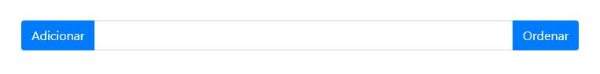

# Atividade p/ fixação do conteúdo #1
>Exercicio proposto p/ praticar os conhecimentos aprendidos em aula sobre o DOM JavaScript e Arrays().

## Passo 1:

**Proposta:** crie uma aplicação web contendo um campo para entrada de texto (input text) e dois
botões (buttons), sendo um botão com a descrição "Adicionar" e outro com a descrição
"Ordenar", conforme imagem abaixo:



Após criar os elementos de interação com o usuário acima, crie um Array de nome objetos contendo
os seguintes valores:

```js
var objetos = Array('Cadeira', 'Impressora', 'Garfo')
```

Ao clicar no botão "Adicionar" disparar função que irá:

- Recuperar o valor contido no campo de texto;
- Verificar se o valor está vazio ou preenchido;
    - Se vazio, exibir alert com a mensagem "Informe um valor válido";
    - Se preenchido:
        - Verificar se o valor informado já existe dentro do Array objetos;
        - Se existir, exibir alert com a mensagem "Objeto já foi adicionado";
        - Se não existir:
            - Incluir o valor preenchido no campo dentro do Array;
            - Efetuar um console.log do Array para debug (checar se está
funcionado);
            - Limpar o valor contido no campo de entrada de texto;

## Passo 2:

Ao clicar no botão "Ordenar" disparar função que irá:

- Ordenar de forma alfabética os valores do Array de objetos;
- Efetuar um console.log do Array para debug (checar se está funcionado).

## Resolução pessoal:

Codificação *html* p/ resolução do case:

```html
<div class="input-group">
           <div class="input-group-prepend">
               <button onclick="recuperarValor()" class="btn btn-primary">Adicionar</button>
           </div>
           
           <input id="entrada" class="form-control" type="text" placeholder="">

           <div class="input-group-append">
               <button onclick="ordemAlfabetica()" class="btn btn-primary">Ordenar</button>
           </div>
      </div>
```

Codificação *JavaScript* p/ resolução do case:

```js
var objetos = Array()

      objetos[0] = 'Cadeira'
      objetos[1] = 'Impressora'
      objetos[2] = 'Garfo'


      function recuperarValor(valor) {

        valor = document.getElementById('entrada').value

        if (valor === '') {

          alert('Informe um valor válido!')
        
        } 

        else {
          
          if (objetos.indexOf(valor) === -1) {

            objetos.push(valor)
            console.log(objetos)
            document.getElementById('entrada').value = ''

          }

          else {

            alert('Objeto já foi adicionado ao Array().')

          }

        }

      }

      function ordemAlfabetica() {

        console.log(objetos.sort())

      }
```
